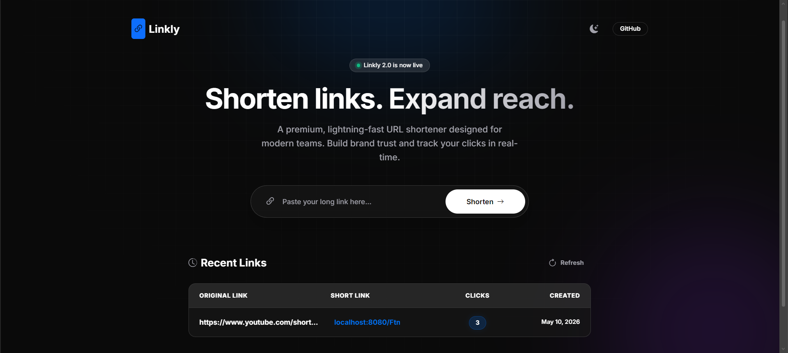
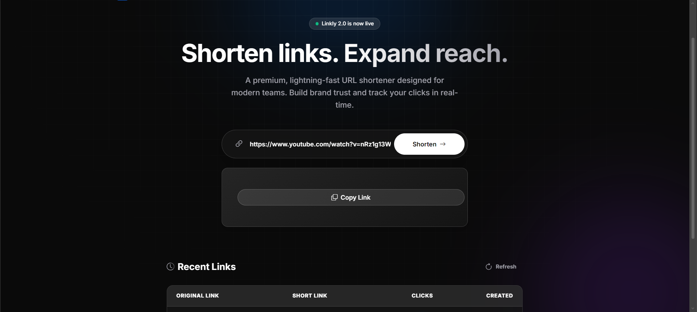

# Full-Stack Java URL Shortener

A beginner-friendly, clean, and modern full-stack URL shortener application built using Java, Spring Boot, MySQL, and vanilla frontend technologies.

## Features

- **Shorten URLs**: Convert long URLs into compact short codes.
- **Redirection**: Automatically redirects users visiting the short link to the original URL.
- **Click Tracking**: Keeps count of how many times a shortened URL is accessed.
- **Modern UI**: A premium, responsive, dark SaaS-style frontend built without complex frameworks.
- **Database Storage**: Uses MySQL and Spring Data JPA for persistent storage.
- **REST API**: Clean backend architecture following MVC patterns.

## Tech Stack

### Backend
- Java 17
- Spring Boot 3.2+ (Web, Data JPA, Validation)
- MySQL Database
- Maven

### Frontend
- HTML5
- CSS3 (Custom Styling & Animations)
- Vanilla JavaScript (Fetch API)
- Bootstrap 5 (Layout & Typography)

## Project Architecture

This application follows a standard Layered Architecture:

1. **Controller Layer** (`UrlApiController.java`, `RedirectController.java`): Handles incoming HTTP requests and routes them.
2. **Service Layer** (`UrlService.java`, `UrlServiceImpl.java`): Contains the core business logic (validating, short code generation).
3. **Repository Layer** (`UrlRepository.java`): Interfaces with the database using Spring Data JPA.
4. **Model Layer** (`Url.java`): Represents the database entity.

## Getting Started

### Prerequisites
- JDK 17 or higher
- Maven 3.6+
- MySQL Server 8.0+

### Setup Instructions

1. **Database Setup**
   The application expects a local MySQL database.
   By default, it uses:
   - Database: `url_shortener` (will be auto-created if not exists)
   - Username: `root`
   - Password: `YOUR_PASSWORD`

   *(You can change these in `src/main/resources/application.properties`)*

2. **Run the Application**
   Navigate to the project root directory and run:
   ```bash
   mvn spring-boot:run
   ```

3. **Access the App**
   Open your browser and navigate to:
   ```
   http://localhost:8080/
   ```

## Auto-Generated Schema

The database tables are automatically generated by Hibernate (configured via `spring.jpa.hibernate.ddl-auto=update`).

The `urls` table contains:
- `id` (Primary Key, Auto Increment)
- `original_url` (Varchar 2048)
- `short_code` (Varchar 10, Unique)
- `click_count` (Integer)
- `created_at` (Timestamp)

# Screenshots

## Homepage


## Result
